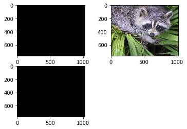
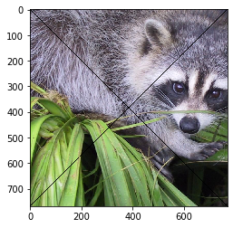
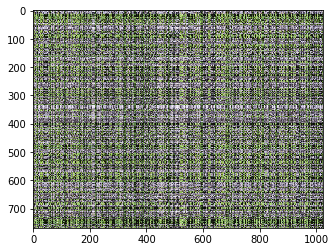
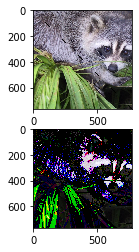

```python
import numpy as np
```


```python
a=np.arange(5)
a.dtype
```


    dtype('int32')


```python
a
```


    array([0, 1, 2, 3, 4])


```python
a.shape
```


    (5,)


```python
m=np.array([np.arange(2),np.arange(2)]) #다차원 배열 arange함수
```


```python
m
```


    array([[0, 1],
           [0, 1]])


```python
m.shape
```


    (2, 2)


```python
a=np.array([[1,2],[3,4]]) #다차원 배열 중첩리스트
```


```python
a
```


    array([[1, 2],
           [3, 4]])


```python
#원소 하나씩 출력
a[0,0]
```


    1


```python
#숫자
np.float64(42)
```


    42.0


```python
np.bool(42)
```


    True


```python
t=np.dtype('Float64')
```

    C:\Users\hyun kyoung oh\Anaconda3\lib\site-packages\ipykernel_launcher.py:1: DeprecationWarning: Numeric-style type codes are deprecated and will result in an error in the future.
      """Entry point for launching an IPython kernel.
    


```python
t.char
```


    'd'


```python
#슬라이싱
a=np.arange(9)
```


```python
a[3:7]
```


    array([3, 4, 5, 6])


```python
a[:7:2]
```


    array([0, 2, 4, 6])


```python
#다차원 -> 1차원
b=np.arange(24).reshape(2,3,4)
print(b)
```

    [[[ 0  1  2  3]
      [ 4  5  6  7]
      [ 8  9 10 11]]
    
     [[12 13 14 15]
      [16 17 18 19]
      [20 21 22 23]]]
    


```python
b
```


    array([[[ 0,  1,  2,  3],
            [ 4,  5,  6,  7],
            [ 8,  9, 10, 11]],
    
           [[12, 13, 14, 15],
            [16, 17, 18, 19],
            [20, 21, 22, 23]]])


```python
b.ravel() #다시 이전 배열로 되돌아감 , 지속적으로 배열 조작가능 = 원본의 view 반환
```


    array([ 0,  1,  2,  3,  4,  5,  6,  7,  8,  9, 10, 11, 12, 13, 14, 15, 16,
           17, 18, 19, 20, 21, 22, 23])


```python
b.flatten() #항상 메모리 할당 = 원본의 copy를 반환
```


    array([ 0,  1,  2,  3,  4,  5,  6,  7,  8,  9, 10, 11, 12, 13, 14, 15, 16,
           17, 18, 19, 20, 21, 22, 23])


```python
#reshape 대신 튜플로 다시 : 자료형이 변환이 안됨
b.shape=(6,4)
```


```python
b
```


    array([[ 0,  1,  2,  3],
           [ 4,  5,  6,  7],
           [ 8,  9, 10, 11],
           [12, 13, 14, 15],
           [16, 17, 18, 19],
           [20, 21, 22, 23]])


```python
b.transpose() #행과 열 바꿈
```


    array([[ 0,  4,  8, 12, 16, 20],
           [ 1,  5,  9, 13, 17, 21],
           [ 2,  6, 10, 14, 18, 22],
           [ 3,  7, 11, 15, 19, 23]])


```python
b.resize((2,12)) #=reshape
```


```python
b
```


    array([[ 0,  1,  2,  3,  4,  5,  6,  7,  8,  9, 10, 11],
           [12, 13, 14, 15, 16, 17, 18, 19, 20, 21, 22, 23]])


```python
a=np.arange(9).reshape(3,3)
```


```python
a
```


    array([[0, 1, 2],
           [3, 4, 5],
           [6, 7, 8]])


```python
b=2*a
```


```python
b
```


    array([[ 0,  2,  4],
           [ 6,  8, 10],
           [12, 14, 16]])


```python
#배열합치기
#1.수평으로 합치기 hstack() = concatenate()
np.hstack((a,b))
```


    array([[ 0,  1,  2,  0,  2,  4],
           [ 3,  4,  5,  6,  8, 10],
           [ 6,  7,  8, 12, 14, 16]])


```python
np.concatenate((a,b),axis=1)
```


    array([[ 0,  1,  2,  0,  2,  4],
           [ 3,  4,  5,  6,  8, 10],
           [ 6,  7,  8, 12, 14, 16]])


```python
#수직으로 합치기 vstack()
np.concatenate((a,b),axis=0)
```


    array([[ 0,  1,  2],
           [ 3,  4,  5],
           [ 6,  7,  8],
           [ 0,  2,  4],
           [ 6,  8, 10],
           [12, 14, 16]])


```python
np.vstack((a,b))
```


    array([[ 0,  1,  2],
           [ 3,  4,  5],
           [ 6,  7,  8],
           [ 0,  2,  4],
           [ 6,  8, 10],
           [12, 14, 16]])


```python
#깊이 우선 배열 합침
np.dstack((a,b))
```


    array([[[ 0,  0],
            [ 1,  2],
            [ 2,  4]],
    
           [[ 3,  6],
            [ 4,  8],
            [ 5, 10]],
    
           [[ 6, 12],
            [ 7, 14],
            [ 8, 16]]])


```python
#열로 합치기 = column_stack() 0열 끼리 1열끼리 1차원->2차원
oned=np.arange(2)
oned
```


    array([0, 1])


```python
twice_oned=2*oned
```


```python
twice_oned
```


    array([0, 2])


```python
np.column_stack((oned,twice_oned)) #1차원을 2차원으로 
```


    array([[0, 0],
           [1, 2]])


```python
#2차원 배열 hstack() 
np.column_stack((a,b)) #2차원일때는 그냥 hstack() 처럼 합침
```


    array([[ 0,  1,  2,  0,  2,  4],
           [ 3,  4,  5,  6,  8, 10],
           [ 6,  7,  8, 12, 14, 16]])


```python
np.column_stack((a,b))==np.hstack((a,b)) #배열비교
```


    array([[ True,  True,  True,  True,  True,  True],
           [ True,  True,  True,  True,  True,  True],
           [ True,  True,  True,  True,  True,  True]])


```python
#행으로 합치기=row_stack() 1차원->2차원
np.row_stack((oned,twice_oned))
```


    array([[0, 1],
           [0, 2]])


```python
#2차원 배열에서 row_stack()=vstack()
np.row_stack((a,b))
```


    array([[ 0,  1,  2],
           [ 3,  4,  5],
           [ 6,  7,  8],
           [ 0,  2,  4],
           [ 6,  8, 10],
           [12, 14, 16]])


```python
np.row_stack((a,b))==np.vstack((a,b))
```


    array([[ True,  True,  True],
           [ True,  True,  True],
           [ True,  True,  True],
           [ True,  True,  True],
           [ True,  True,  True],
           [ True,  True,  True]])


```python
#split() 쪼개기 vspilt() 수직으로, dsplit()=깊이우선
c=np.arange(27).reshape(3,3,3)
```


```python
c
```


    array([[[ 0,  1,  2],
            [ 3,  4,  5],
            [ 6,  7,  8]],
    
           [[ 9, 10, 11],
            [12, 13, 14],
            [15, 16, 17]],
    
           [[18, 19, 20],
            [21, 22, 23],
            [24, 25, 26]]])


```python
np.dsplit(c,3)
```


    [array([[[ 0],
             [ 3],
             [ 6]],
     
            [[ 9],
             [12],
             [15]],
     
            [[18],
             [21],
             [24]]]), array([[[ 1],
             [ 4],
             [ 7]],
     
            [[10],
             [13],
             [16]],
     
            [[19],
             [22],
             [25]]]), array([[[ 2],
             [ 5],
             [ 8]],
     
            [[11],
             [14],
             [17]],
     
            [[20],
             [23],
             [26]]])]


```python
#배열 어트리뷰트
b=np.arange(24).reshape(2,12)
```


```python
b
```


    array([[ 0,  1,  2,  3,  4,  5,  6,  7,  8,  9, 10, 11],
           [12, 13, 14, 15, 16, 17, 18, 19, 20, 21, 22, 23]])


```python
b.resize(6,4)
b
```


    array([[ 0,  1,  2,  3],
           [ 4,  5,  6,  7],
           [ 8,  9, 10, 11],
           [12, 13, 14, 15],
           [16, 17, 18, 19],
           [20, 21, 22, 23]])


```python
b.ndim #차원
```


    2


```python
b.size
```


    24


```python
#flat 속성 - numpy.flatiter 객체를 반환
f=b.flat
```


```python
f
```


    <numpy.flatiter at 0x18056268a50>


```python
#원소로 바로접근
b.flat[21]
```


    21


b.flat[[1,3]]


```python
b.flat[[1,3]]
```


    array([1, 3])


```python
b.flat=7
```


```python
b
```


    array([[7, 7, 7, 7, 7, 7, 7, 7, 7, 7, 7, 7],
           [7, 7, 7, 7, 7, 7, 7, 7, 7, 7, 7, 7]])


```python
b.flat[[2,12]]=1 #인덱스로 선택 여러개. 원소 바뀜
```


```python
b
```


    array([[7, 7, 1, 7, 7, 7, 7, 7, 7, 7, 7, 7],
           [1, 7, 7, 7, 7, 7, 7, 7, 7, 7, 7, 7]])


```python
#배열 뷰 생성하고 복사하기
# 배열의 특정부분을 뷰로 만들수있고 수정가능
#SciPy 패키지의 face()함수 사용
import scipy.misc
import matplotlib.pyplot as plt
face=scipy.misc.face().copy() #얼굴이미지 가져오기
acopy=face.copy() #배열의 복사본 생성
aview=face.view() #배열의 뷰도 생성
aview.flat=0 #뷰의 모든 값을 flat 연산자를 통해 0으로 한다
plt.subplot(221)
plt.imshow(face)
plt.subplot(222)
plt.imshow(acopy)
plt.subplot(223)
plt.imshow(aview)
```


    <matplotlib.image.AxesImage at 0x278cffe7e48>





```python
#예제
import scipy.misc
import matplotlib.pyplot as plt

face = scipy.misc.face().copy()
xmax = face.shape[0]
ymax = face.shape[1]
face=face[:min(xmax,ymax),:min(xmax,ymax)]
xmax = face.shape[0]
ymax = face.shape[1]
face[range(xmax), range(ymax)] = 0  #대각선 값을 모두 0으로
face[range(xmax-1,-1,-1), range(ymax)] = 0   #반대쪽 대각선 값도 모두 0
plt.imshow(face)
plt.show()
```





```python
#indexing with list of locations
import scipy.misc
import matplotlib.pyplot as plt
import numpy as np

face = scipy.misc.face()
xmax = face.shape[0]
ymax = face.shape[1]

def shuffle_indices(size): #무작위 인덱스 배열 생성
   arr = np.arange(size)
   np.random.shuffle(arr)

   return arr

xindices = shuffle_indices(xmax)
np.testing.assert_equal(len(xindices), xmax)  #같은지 확인
yindices = shuffle_indices(ymax)
np.testing.assert_equal(len(yindices), ymax)
plt.imshow(face[np.ix_(xindices, yindices)])
#numpy.ix_():특정 열과 행이 교차하는 자리에 위치한 요소를 꺼낼 때
#1차원 시퀀스를 파라미터로 지정해 numpy배열의 튜플형태로 반환
plt.show()
```





```python
#논리형 인덱싱
import scipy.misc
import matplotlib.pyplot as plt
import numpy as np

face = scipy.misc.face()
xmax = face.shape[0]
ymax = face.shape[1]
face=face[:min(xmax,ymax),:min(xmax,ymax)]

def get_indices(size):
   arr = np.arange(size)
   return arr % 4 == 0
#대각선 값중 4의 배수만 선택
face1 = face.copy() 
xindices = get_indices(face.shape[0]) #점들을 그래프로 
yindices = get_indices(face.shape[1])
face1[xindices, yindices] = 0
plt.subplot(211)
plt.imshow(face1)
face2 = face.copy() 
face2[(face > face.max()/4) & (face < 3 * face.max()/4)] = 0
##최댓값의 1/4부터 3/4에 해당하는 배열 값을 모두 0으로 처리
plt.subplot(212)
plt.imshow(face2)
plt.show()
```





```python

```
